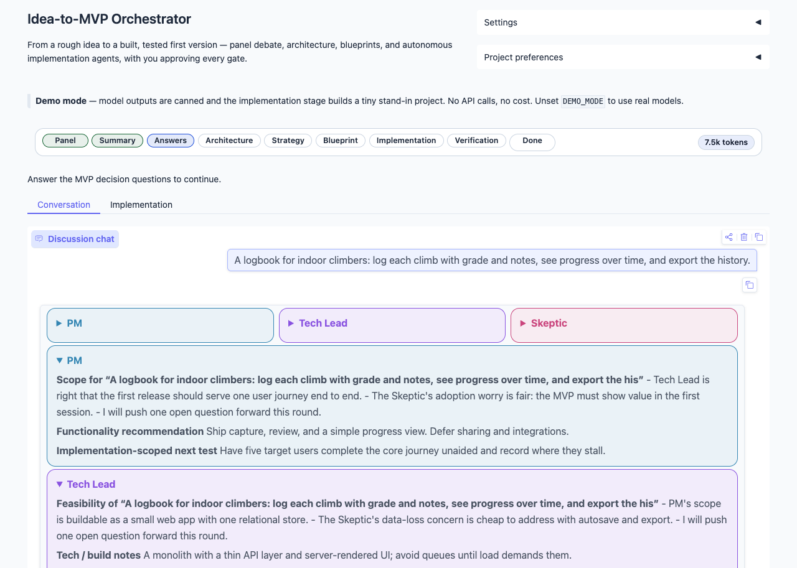
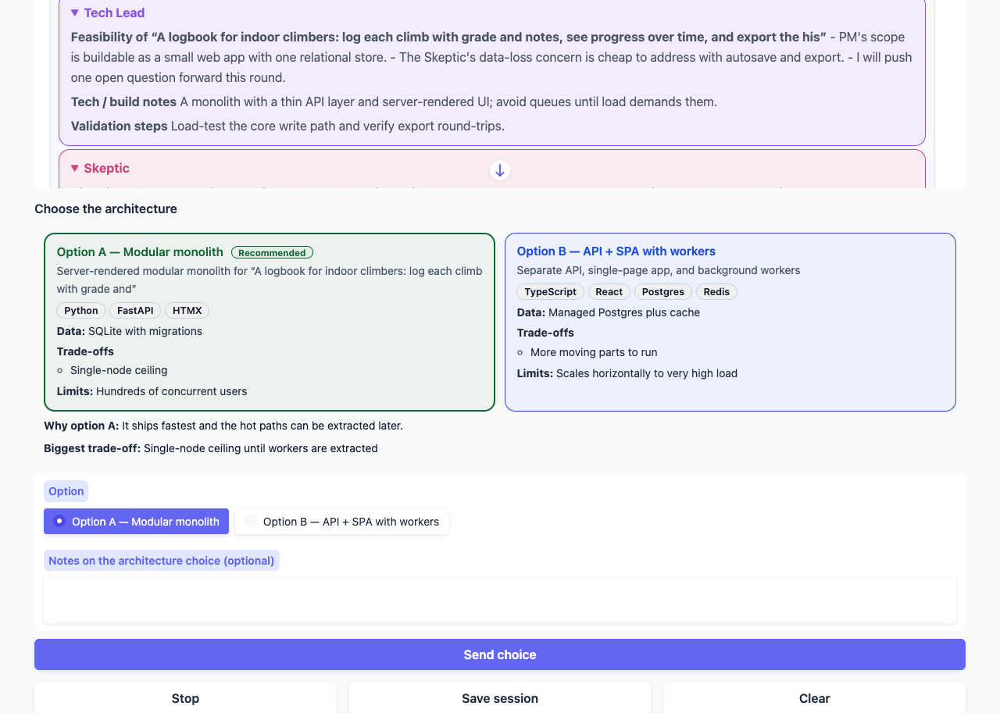
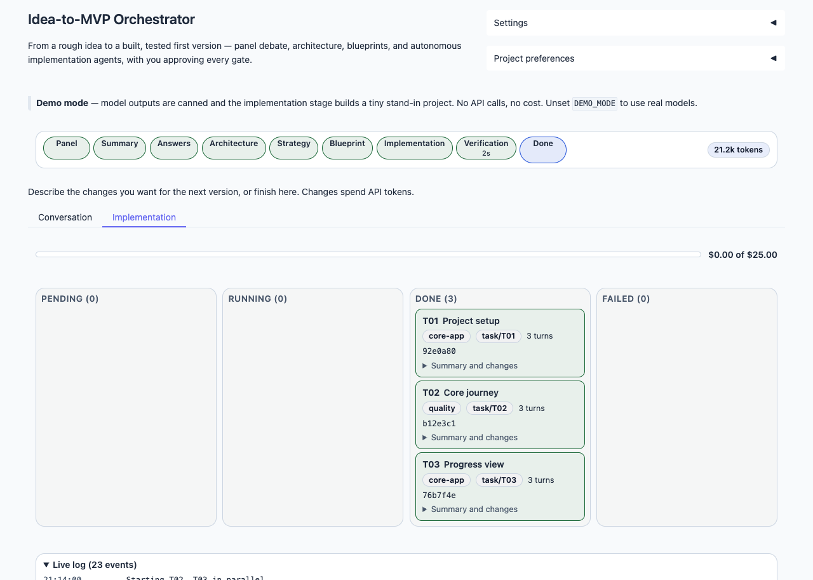
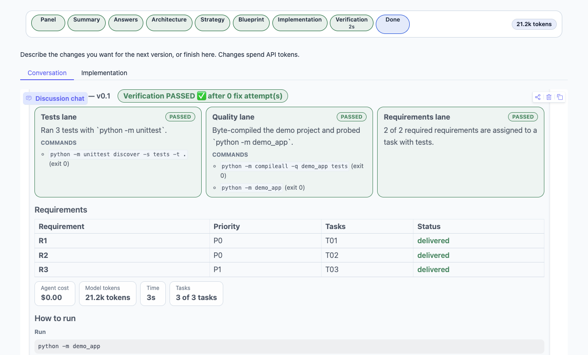

# Idea-to-MVP Orchestrator

Turn a rough product idea into a **built, tested first version**. A LangGraph pipeline runs every stage with a dedicated agent: a multi-LLM panel debates the idea, an architect proposes options, a planner writes an agent-ready blueprint, and Claude Agent SDK agents implement the project in parallel and verify it. You approve every gate, and nothing that spends money runs without your say-so.



## Quick start (60 seconds)

You need [uv](https://docs.astral.sh/uv/); it installs the right Python (3.11 to 3.13) for you.

```bash
uv sync
DEMO_MODE=true uv run idea-to-mvp
```

Demo mode walks the whole pipeline (panel, gates, blueprint pack, a stand-in implementation, verification, delivery report) with canned outputs: no API keys, no spend. Type an idea, or open **Settings** and switch **Autopilot** on to ride through the gates.

For a real run:

```bash
cp .env.example .env            # add OPENAI_API_KEY, ANTHROPIC_API_KEY, GOOGLE_API_KEY
uv run idea-to-mvp doctor       # checks keys, model IDs, and the agent CLI before you spend anything
uv run idea-to-mvp
```

The implementation stage needs `ANTHROPIC_API_KEY` (it drives the Claude Agent SDK). Everything the app writes goes under `OUTPUT_DIR` (default `~/idea-to-mvp`, outside this repository).

## What you get

**Gates that ask the right question.** The MVP questions come prefilled with suggested answers; the architecture options sit side by side with a recommendation.



**Agents you can watch.** Independent plan tasks run in parallel git worktrees while a live board, log, and cost meter follow them.



**A delivery you can run.** Three verification lanes (tests, quality, requirement coverage), a requirement-by-requirement table, how to run the project, a zip, a `v0.1` git tag, and a form to ask for v0.2.



## The pipeline

```
Idea ─ (optional web research) ─→ Panel ─→ Summary + 5 MVP questions
  🔒 you answer  ─→ Architect: two options
  🔒 you choose  ─→ Strategy ─→ Blueprint pack (PRD, architecture, plan, subagents), reviewed by a critic
  🔒 you approve the blueprint and the spend
  ─→ Implementation (parallel tasks) ─→ Verification (3 lanes, fix loop) ─→ Delivery report
  🔁 ask for changes ─→ v0.2, same machinery
```

Every 🔒 is a real pause: the whole session is one checkpointed LangGraph thread, stored in SQLite, so you can close the app and pick up where you stopped.

## Why it's built this way

- **One durable graph with human gates.** `interrupt()` pauses and `Command(resume=...)` continues a single checkpointed thread, and the UI is a pure projection of that state, so restarts, Stop, and Continue need no extra bookkeeping.
- **Parallel where the work is independent.** `Send` fans out the panel's openings, the blueprint's documents, the plan's tasks (in git worktrees), and the verification lanes, each bounded by concurrency and budget caps.
- **Typed hand-offs and loops that check themselves.** Agents exchange validated Pydantic objects instead of prose, the plan is machine-checked, and a critic/revise loop and a verify/fix loop catch problems before you do.
- **Autonomous agents, but confined.** An OS sandbox, a tool-call guard, a scrubbed environment, and whole-run cost caps bound what the implementation agents can do; [SECURITY.md](SECURITY.md) says exactly what is and is not protected.
- **Offline-first, so it stays testable.** Every model call has a demo fixture, which lets CI run the entire pipeline (and three golden blueprint ideas) without a key.

## Learn more

- [docs/architecture.md](docs/architecture.md): the graph, the state contract, the LangGraph patterns used (each mapped to code and a test), and how to add an agent or a gate
- [.env.example](.env.example): every setting, with its default and meaning
- [SECURITY.md](SECURITY.md): the agent-execution threat model and how to report a vulnerability
- [CONTRIBUTING.md](CONTRIBUTING.md): development setup and quality checks
- [CHANGELOG.md](CHANGELOG.md): what changed, including upgrade notes

Before a real implementation run, check `IMPLEMENTER_MAX_TOTAL_USD` (the whole-run cost cap); the implementation gate shows the model, sandbox status, and budget before anything starts. Never commit `.env` or API keys.

## License

MIT. See [LICENSE](LICENSE).
