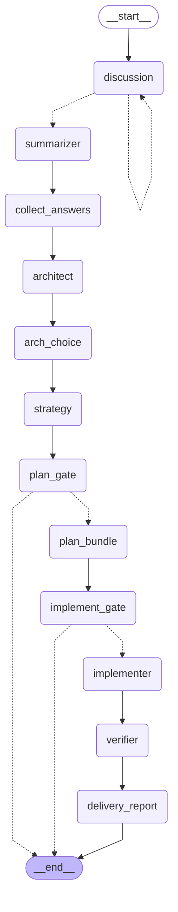

# Architecture

`idea-to-mvp` is a Gradio + LangGraph app that takes a product idea through a structured multi-agent pipeline and produces a built, tested first version. This file is the single home for how it is put together; setup lives in `CONTRIBUTING.md`, settings in `.env.example`, and the threat model in `SECURITY.md`.

## Pipeline

1. **Discussion** — three agents (PM, Tech Lead, Skeptic) debate the idea round-robin until `max_rounds` turns.
2. **Summarizer** — executive brief plus exactly 5 clarifying MVP questions.
3. **Answers gate** — the graph pauses at `collect_answers` (`interrupt()`); the user's answers resume it. Each question carries a reason it matters and a suggested answer.
4. **Architect + architecture gate** — two options; the graph pauses at `arch_choice` for a structured `{option, notes}` decision.
5. **Strategy** — emits a validated `ExecutionStrategy` `{mode, reasoning, workstreams}` choosing `subagents` vs `agent_team` (deterministic fallback strategy if the model output stays invalid).
6. **Plan gate + blueprint** — pause at `plan_gate` (static question); `{generate, notes}` resumes and writes the blueprint pack.
7. **Implementation gate + implementer** — pause at `implement_gate` with a cost warning; `{implement, notes}` resumes. `implementer.py` copies the pack into the projects directory and drives Claude Agent SDK sessions (lead + subagents, or sequential team).
8. **Verifier + delivery report** — a verification agent runs the generated project's tests (`VERDICT: PASS|FAIL` sentinel) with a bounded fix loop, then a deterministic delivery report ends the run.

The graph below is generated from the real `StateGraph` (`uv run python scripts/gen_graph_diagram.py`; a test fails if it drifts).

<!-- graph:start -->

<!-- graph:end -->

The `discussion` node loops on itself until `turn_count ≥ max_rounds`; `plan_gate` and `implement_gate` can end the run early.

The graph runs on a single checkpointer thread per session; the UI resumes interrupts with `Command(resume=...)`. There is no `phase` field — UI mode is derived from the interrupt the graph is paused at.

## Modules

Everything lives in the `idea_to_mvp` package under `src/`.

| Module | Role |
|---|---|
| `config.py` | Pydantic `Settings` loaded from `.env`; `get_settings()`; output directories (`exports_dir`, `blueprints_dir`, `projects_dir` under `output_dir`) |
| `state.py` | `IdeaDiscussionState` TypedDict — the single shared state contract — and `make_initial_state()` |
| `graph.py` | `build_graph(checkpointer)`: nodes and conditional routing; `open_graph()` (SQLite/memory checkpointer lifecycle), `GraphProvider` (lazy, loop-safe handle for the UI), `pending_interrupt()` |
| `resilience.py` | `LLM_RETRY`: LangGraph retry policy (3 attempts, backoff) for transient errors only (`is_transient`) |
| `usage.py` | `UsageRecord`, the `@with_usage(role=...)` node decorator, `summarize_usage`, `format_usage` |
| `observability.py` | `apply_tracing_env()`: exports only `LANGSMITH_*`/`LANGCHAIN_*` from `.env` |
| `doctor.py`, `cli.py` | `idea-to-mvp doctor` (keys, models, agent CLI) and the command-line entry point |
| `sessions.py` | `SessionRegistry`: the list of resumable sessions (title, stage, gate) next to the checkpoints |
| `nodes/` | One module per pipeline concern: `discussion`, `summary`, `architecture`, `strategy`, `gates` (all `interrupt()` gates and their routers), `blueprint`, `implement`, `verify`, `report`; `common` holds helpers shared with the UI |
| `llm/` | Model access: `providers.py` (vendor SDK construction and quirks), `runtime.py` (`get_runtime(role_key)`), `invoke.py` (`invoke_text`), `structured.py` (`invoke_structured`) |
| `schemas.py` | Pydantic models exchanged between agents (`QuestionSet`, `ArchitectureProposal`, `ExecutionStrategy`) and their markdown renderers |
| `roles.py` | `RoleSpec` registry: system prompts and provider/model/token wiring per agent |
| `blueprints.py` | Blueprint document prompts and `create_project_bundle()` (LLM-free; caller injects `generate_doc`) |
| `implementer.py` | Claude Agent SDK sessions: workspace prep, implementation, verification, fix loop |
| `exporter.py` | Timestamped Markdown session exports |
| `demo/` | Offline demo mode: `DemoChatModel` + `fixtures.py` (canned, idea-aware output per role) and a stand-in implementation/verification stage |
| `text_utils.py` | `normalize_content()` shared by the LLM layer and the UI service |
| `ui/app.py` | Gradio entrypoint (`make_ui()`, `main()`), started by `idea-to-mvp` / `python -m idea_to_mvp` |
| `ui/service.py` | `SubmitService`: async generator bridge between Gradio and the graph; renders every response from checkpointed state |
| `ui/view.py` | Pure projection of graph state to the UI: `transcript_from_state`, `mode_from_state`, status and stage helpers (no Gradio) |
| `ui/render.py` | HTML helpers (`thinking_block`, `turn_block`, `stage_tracker`) |

## State contract

`IdeaDiscussionState` (`state.py`) carries: `user_idea`, `discussion_history` (LangChain messages, `add_messages` reducer), `summary`, `questions` + `generated_questions` (the `MvpQuestion` dumps and their numbered-line rendering), `user_answers`, `architecture_proposal` + `architecture` (the `ArchitectureProposal` dump and its markdown rendering), `arch_choice`, `execution_strategy` (an `ExecutionStrategy` dump), `plan_decision`, `implement_decision`, `project_bundle_dir/files/summary`, `workspace_dir`, `implementation_log`, `verification`, `delivery_report`, `stage`, `next_speaker`, `max_rounds`, `turn_count`. Gate decisions are small TypedDicts (`ArchChoice`, `PlanDecision`, `ImplementDecision`).

## Multi-provider LLM abstraction

- `llm.get_runtime(role_key)` returns a cached, frozen `AgentRuntime` (LangChain `BaseChatModel` + provider, model, token budget, system prompt) for any role in `roles.ROLES` (PM = OpenAI, Tech Lead / Summarizer / Architect = Anthropic, Skeptic = Google by default). The provider is always the configured one; `warn_on_provider_mismatch()` only logs an obviously wrong pairing.
- Nodes call `llm.invoke_text(runtime, messages)` and get plain text back ('' when the model produced none). It is the single owner of retries: Google output truncated by `MAX_TOKENS` is retried with a larger `max_output_tokens`, and an empty reply is retried once with an instruction to answer visibly.
- Agents that hand structure to other agents use `llm.invoke_structured(runtime, messages, Schema, fallback=...)` and get a validated pydantic instance. It asks the provider for schema-constrained output (Anthropic: native `json_schema`, because newer Claude models reject forced tool use), retries once with the validation error appended, then uses the deterministic `fallback` (logged) or raises `StructuredOutputError`. Schemas are kept provider-safe: all fields required, and counts/lengths enforced by Python validators rather than JSON-schema keywords. State stores `model_dump()` dicts; prompts no longer describe output formats, the schema does.
- Newer models reject or discourage sampling parameters, so `sampling_kwargs()` only forwards `TEMPERATURE` to models that accept it.

## Demo mode

`DEMO_MODE=true` makes `llm.get_runtime()` return runtimes backed by `demo.models.DemoChatModel`, which answers from `demo/fixtures.py` (`RESPONSES[role]`); blueprint documents are told apart by their system prompt. `implementer.run_implementation` / `run_verification` / `run_fix` dispatch to `demo/implementer.py`, which writes a tiny dependency-free project and verifies it by really running its `unittest` suite. The UI shows a banner. `tests/test_e2e_demo.py` drives the real graph and `SubmitService` through every gate this way, offline, in CI.

**Demo-parity rule:** any new LLM call, structured schema, or SDK agent session needs a fixture in `demo/` so the offline pipeline keeps working end to end.

## Persistence, resume, and the state-derived UI

- **Checkpoints:** `CHECKPOINTER=sqlite` (default) stores every graph checkpoint in `OUTPUT_DIR/sessions.db` through `AsyncSqliteSaver`; `memory` keeps them for the life of the process. Gates are `interrupt()` pauses, so a checkpointer is always required. The aiosqlite worker thread is made a daemon so an open connection can never keep the process alive after Ctrl+C.
- **Async runtime:** the UI drives the graph with `graph.astream(..., stream_mode="updates")`; sync nodes run in worker threads. `GraphProvider` opens the graph lazily inside the event loop that will use it (Gradio builds the UI synchronously but serves from its own loop).
- **The UI is a projection of state.** After every graph update `SubmitService` re-reads the thread's checkpoint and derives the chat (`transcript_from_state`), the UI mode (`mode_from_state`: idea → answers → arch choice → plan gate → implement gate → done, plus `interrupted` for a run that stopped mid-step), the status line, and the stage tracker from it. The browser session only remembers the thread id, so a session can be rebuilt after a restart and no copy of pipeline state can drift. Transient overlays (the message just sent, the step in progress, an error) are added on top of the derived transcript and vanish on the next render.
- **Resume:** the *Saved sessions* panel lists `SessionRegistry` rows; *Resume selected* re-renders that thread at whatever gate it was waiting at. A run that crashed between gates shows a *Continue* button, which calls `astream(None, config)` to carry on from the last checkpoint instead of restarting.

## Resilience, usage, and tracing

- **Two retry layers.** Provider SDKs retry HTTP-level failures themselves (`LLM_MAX_RETRIES`, per-request `LLM_TIMEOUT_SECONDS`). Nodes that call a model (`discussion`, `summarizer`, `architect`, `strategy`, `plan_bundle`) also carry `LLM_RETRY`, so a node that still fails with a *transient* error (rate limit, timeout, connection reset, 5xx; matched by exception class name and status code, no provider imports) is re-run with backoff instead of failing the stage. Auth, validation, and schema errors are never retried.
- **Usage.** Model-calling nodes are wrapped with `@with_usage(role=...)`, which records every model call made during the node (text and structured, retries included) via LangChain's usage callback and appends `UsageRecord`s to the accumulating `usage` state channel. `cost_usd` is None for plain model calls (prices are not hard-coded); Agent SDK sessions will report a dollar cost. The UI status line shows the running total (`format_usage`).
- **Tracing.** Set `LANGSMITH_TRACING=true` and `LANGSMITH_API_KEY` in `.env` (or the shell). Only `LANGSMITH_*`/`LANGCHAIN_*` are exported from `.env` — provider keys are deliberately not, because agent subprocesses inherit the environment. Runs are named `idea-to-mvp` and tagged `thread:<id>` (`graph.run_config`).
- **`idea-to-mvp doctor [--offline]`** checks every role's key and, unless `--offline`, makes one tiny real call per distinct provider/model; it also checks the bundled Claude Code CLI. Failures are reported per role; exit code 1 if any check failed.

## Streaming UI

`SubmitService.handle_submit()` is an async generator that yields one Gradio update tuple per graph update, so the chat streams as nodes finish. Gate decisions become `Command(resume=...)` payloads; interrupts select the next UI mode.

## Blueprint pack

When the user accepts the plan gate, the pack is written to a timestamped folder in `blueprints_dir`: `README.md`, `PRD.md` (numbered requirements), `ARCHITECTURE.md`, `AGENTS.md` plus scoped `contracts/`, `application/`, `quality/` guides, `plan.md` (task list with contract registry and acceptance criteria), `.claude/agents/*.md` (one subagent per workstream), and `STRATEGY.json`. Each document has its own system prompt in `blueprints.py`.

## Output locations

All generated data goes under `OUTPUT_DIR` (default `~/idea-to-mvp`, outside the repository): `exports/`, `blueprints/`, `projects/`, and `sessions.db` (checkpoints + session list).

## Conventions

- **Imports:** absolute (`from idea_to_mvp.config import get_settings`); no relative or dual-import fallbacks. The package is installed editable by `uv sync`, so tests and the app import it the same way.
- **Calling the LLM layer:** nodes use `from idea_to_mvp import llm` and call `llm.get_runtime(...)` / `llm.invoke_text(...)` / `llm.invoke_structured(...)` through the package namespace, and use `from idea_to_mvp import implementer` for SDK sessions, so a test can monkeypatch one attribute for every node.
- **Test isolation:** `config.clear_settings_cache()` resets the `lru_cache` between tests; point `OUTPUT_DIR` at `tmp_path` via `monkeypatch.setenv`. Graph lifecycle tests fake all LLM/SDK calls by monkeypatching `llm.get_runtime`, `llm.invoke_text`, `llm.invoke_structured` (answer from `demo.fixtures.respond_structured`), and `implementer.prepare_workspace` / `run_implementation` / `run_verification` / `run_fix` — see `tests/test_graph_lifecycle.py`.
- **Driving the service in tests:** use the `demo_service` fixture (`tests/conftest.py`: demo models + a real SQLite checkpointer under `tmp_path`) and `tests/service_helpers.py`; graph-level tests use `build_graph(MemorySaver())`.
- **Model-calling nodes:** decorate with `@with_usage(role=...)` and register them in `graph.py` with `retry_policy=LLM_RETRY`.
- **Demo parity:** new LLM calls and agent sessions get a demo fixture (see Demo mode); `tests/test_e2e_demo.py` fails otherwise.
- **Graph diagram:** after changing graph topology run `uv run python scripts/gen_graph_diagram.py`.
