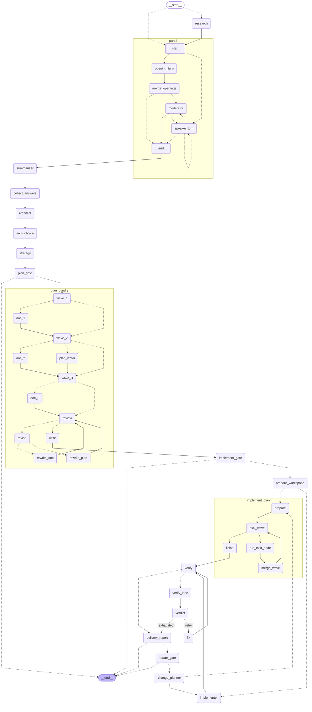

# Architecture

`idea-to-mvp` is a Gradio + LangGraph app that takes a product idea through a structured multi-agent pipeline and produces a built, tested first version. This file is the single home for how it is put together; setup lives in `CONTRIBUTING.md`, settings in `.env.example`, and the threat model in `SECURITY.md`.

## Pipeline

0. **Research (optional, `ENABLE_RESEARCH`)** — a researcher model searches the web with its provider's own search tool and a validated, cited `ResearchBrief` (competitors with links, market notes, gaps) is handed to the panel and shown in the chat (see *The research step*).
1. **Panel** — three agents (PM, Tech Lead, Skeptic) write their opening statements in parallel, then a moderator picks who speaks next and ends the debate early once it has converged, within a turn budget of `rounds × 3` (`PANEL_MODE=round_robin` keeps the fixed rotation).
2. **Summarizer** — executive brief plus exactly 5 clarifying MVP questions.
3. **Answers gate** — the graph pauses at `collect_answers` (`interrupt()`); the user's answers resume it. Each question carries a reason it matters and a suggested answer.
4. **Architect + architecture gate** — two options; the graph pauses at `arch_choice` for a structured `{option, notes}` decision.
5. **Strategy** — emits a validated `ExecutionStrategy` `{mode, reasoning, workstreams}` choosing `subagents` vs `agent_team` (deterministic fallback strategy if the model output stays invalid).
6. **Plan gate + blueprint** — pause at `plan_gate` (static question); `{generate, notes}` resumes and writes the blueprint pack in three dependency waves (PRD and architecture first, then the plan and guides written from them, then the subagents written from the plan).
7. **Implementation gate + implementer** — pause at `implement_gate` with a cost warning and a truthful statement of the sandbox status, permission mode, and allowed domains (a red warning card when the sandbox is off or the mode is `bypassPermissions`); `{implement, notes}` resumes. the `prepare_workspace` node copies the pack into the projects directory as a git repository (its own checkpointed step, so a continued run reuses the same workspace), then it is built: one fresh Claude Agent SDK session per plan task for strategy mode `agent_team`, run in parallel git worktrees by the `implement_plan` subgraph (or one at a time by `implementer` when `IMPLEMENTER_MAX_PARALLEL=1`; see *The implementation engine*), or one lead session with subagents for `subagents`; sessions are configured by `implementation/options.py` and the orchestrator commits.
8. **Verification + delivery report** — three read-mostly lanes (tests, quality, requirements) run in parallel and each returns a structured `LaneReport`; a `verdict` node folds them, failed rounds go to a `fix` node and back to `verify` (a bounded, checkpointed loop; see *Verification lanes*), then a deterministic delivery report (with the delivery zip and a `v0.<n>` git tag when verification passed) follows.
9. **Iterate gate** — after every delivery the graph pauses at `iterate_gate` with `{iterate, feedback}`: changes loop through `change_planner` back into the same engine for the next version; finishing (or reaching `MAX_ITERATIONS`) ends the run (see *Iteration loop*).

The graph below is generated from the real `StateGraph` (`uv run python scripts/gen_graph_diagram.py`; a test fails if it drifts).

<!-- graph:start -->

<!-- graph:end -->

`panel` is a subgraph (see *The panel* below); `plan_gate` and `implement_gate` can end the run early.

The graph runs on a single checkpointer thread per session; the UI resumes interrupts with `Command(resume=...)`. There is no `phase` field — UI mode is derived from the interrupt the graph is paused at.

## LangGraph patterns used

Each row is a pattern, the code that implements it, and a test that would fail without it (the paths and test names are checked by `tests/test_docs_sync.py`).

| Pattern | Where | Test |
|---|---|---|
| **Human gates**: `interrupt()` pauses the thread with a payload, `Command(resume=...)` continues it; autopilot auto-resumes the safe gates, never the implement gate | `src/idea_to_mvp/nodes/gates.py` | `tests/test_graph_lifecycle.py::test_full_pipeline_pauses_resumes_and_declines` |
| **Durable checkpointer and resume**: `AsyncSqliteSaver` behind `GraphProvider`; a paused gate survives a restart and a crashed step continues with `astream(None, config)` | `src/idea_to_mvp/graph.py` | `tests/test_persistence.py::test_run_that_crashed_mid_step_continues_from_its_checkpoint` |
| **`Send` map-reduce (1/4)**: the panel's three opening statements, merged in canonical order | `src/idea_to_mvp/nodes/panel.py` | `tests/test_panel.py::test_openings_run_in_parallel_and_land_in_canonical_order` |
| **`Send` map-reduce (2/4)**: blueprint documents in dependency waves, one task per document | `src/idea_to_mvp/nodes/blueprint_graph.py` | `tests/test_blueprint_dag.py::test_each_wave_requests_all_of_its_documents_concurrently` |
| **`Send` map-reduce (3/4)**: independent plan tasks in parallel git worktrees, merged back in task order | `src/idea_to_mvp/nodes/implement_graph.py` | `tests/test_implement_parallel.py::test_the_demo_plan_runs_its_independent_tasks_in_parallel_and_merges_them` |
| **`Send` map-reduce (4/4)**: the three verification lanes | `src/idea_to_mvp/nodes/verify.py` | `tests/test_verify_graph.py::test_a_clean_verification_runs_three_lanes_in_parallel_and_needs_no_fix` |
| **Reducers for parallel writers**: dict-merge channels (`opening_turns`, `blueprint_docs`, `task_results`, `lane_reports`) so concurrent branches add to state instead of overwriting it | `src/idea_to_mvp/state.py` | `tests/test_panel.py::test_panel_usage_is_recorded_once_in_the_parent_state` |
| **Subgraphs** with a narrower input schema (`PanelInput`, `BlueprintInput`) so accumulating channels are not counted twice; streamed with `subgraphs=True` and folded by `merged_values` | `src/idea_to_mvp/nodes/panel.py` | `tests/test_panel.py::test_the_panel_is_one_node_whose_llm_nodes_carry_the_retry_policy` |
| **Structured output**: Pydantic schemas, one retry with the validation error, then a deterministic fallback | `src/idea_to_mvp/llm/structured.py` | `tests/test_structured.py::test_retries_once_with_the_validation_error_then_succeeds` |
| **Evaluator-optimizer loop (1/2)**: a critic reviews the blueprint and only the documents it blocks are regenerated, up to `MAX_BLUEPRINT_REVISIONS` | `src/idea_to_mvp/nodes/blueprint_graph.py` | `tests/test_blueprint_dag.py::test_blockers_regenerate_only_the_named_documents_then_the_pack_is_reviewed_again` |
| **Evaluator-optimizer loop (2/2)**: verify, then a checkpointed fix step, then verify again, bounded by `MAX_FIX_ATTEMPTS` | `src/idea_to_mvp/graph.py` | `tests/test_verify_graph.py::test_every_fix_attempt_is_its_own_checkpointed_graph_step_until_the_attempts_run_out` |
| **Retry policies**: `LLM_RETRY` re-runs model nodes on transient errors only (rate limit, timeout, 5xx) | `src/idea_to_mvp/resilience.py` | `tests/test_resilience.py::test_node_is_retried_on_transient_errors_until_it_succeeds` |
| **Custom stream events**: `get_stream_writer()` publishes live implementation events beside the `updates` stream | `src/idea_to_mvp/nodes/implement.py` | `tests/test_implement_engine.py::test_custom_events_stream_while_the_node_runs` |
| **Token streaming** (`messages` mode), attributed to a speaker through the model's metadata | `src/idea_to_mvp/ui/view.py` | `tests/test_panel.py::test_demo_panel_turns_stream_token_by_token_with_their_speaker` |
| **Conditional entry edge**: an optional node that the graph skips unless enabled | `src/idea_to_mvp/nodes/research.py` | `tests/test_research.py::test_research_runs_only_when_enabled` |
| **Cancellation**: Gradio's `cancels=` stops the run between checkpoints; the thread keeps its last checkpoint and the UI offers Continue | `src/idea_to_mvp/ui/service.py` | `tests/test_stop.py::test_a_stopped_run_continues_to_the_next_gate` |

## Modules

Everything lives in the `idea_to_mvp` package under `src/`.

| Module | Role |
|---|---|
| `config.py` | Pydantic `Settings` loaded from `.env`; `get_settings()`; output directories (`exports_dir`, `blueprints_dir`, `projects_dir` under `output_dir`); `PROFILES`, the model choice of every role per `model_profile` (`fast` / `balanced` / `quality`; `balanced` equals the field defaults, a test keeps them equal) |
| `state.py` | `IdeaDiscussionState` TypedDict — the single shared state contract — and `make_initial_state()` |
| `graph.py` | `build_graph(checkpointer)`: nodes and conditional routing; `open_graph()` (SQLite/memory checkpointer lifecycle), `GraphProvider` (lazy, loop-safe handle for the UI), `pending_interrupt()` |
| `resilience.py` | `LLM_RETRY`: LangGraph retry policy (3 attempts, backoff) for transient errors only (`is_transient`) |
| `usage.py` | `UsageRecord`, the `@with_usage(role=...)` node decorator, `summarize_usage` |
| `observability.py` | `apply_tracing_env()`: exports only `LANGSMITH_*`/`LANGCHAIN_*` from `.env` |
| `doctor.py`, `cli.py` | `idea-to-mvp doctor` (keys, models, agent CLI) and the command-line entry point |
| `sessions.py` | `SessionRegistry`: the list of resumable sessions (title, stage, gate) next to the checkpoints |
| `nodes/` | One module per pipeline concern: `research` (the optional research step), `panel` (the panel subgraph), `discussion` (one speaker turn), `blueprint_graph` (the blueprint subgraph) with its node functions in `blueprint`, `summary`, `architecture`, `strategy`, `gates` (all `interrupt()` gates and their routers), `blueprint`, `implement`, `verify` (the `verify` / `verify_lane` / `verdict` / `fix` steps), `report`, `iterate` (the iterate gate and `change_planner`); `common` holds helpers shared with the UI and `preferences_block`, the one prompt section that carries the user's project preferences |
| `llm/` | Model access: `providers.py` (vendor SDK construction and quirks), `runtime.py` (`get_runtime(role_key)`), `invoke.py` (`invoke_text`, and `invoke_grounded` for a web-search call, which also returns the URLs the provider cited), `structured.py` (`invoke_structured`); `providers.web_search_tool` and `runtime.search_runtime` bind a provider's native search tool |
| `schemas.py` | Pydantic models exchanged between agents (`ModeratorDecision`, `QuestionSet`, `ArchitectureProposal`, `ExecutionStrategy`) and their markdown renderers, plus `ProjectPreferences` (user input, not a model output) |
| `roles.py` | `RoleSpec` registry: system prompts and provider/model/token wiring per agent; `resolve_role_model(settings, role)` is the one place that decides which provider and model a role runs on (an explicit `*_PROVIDER` / `*_MODEL` wins over the profile, known through `model_fields_set`; `llm.get_runtime`, `doctor`, and the UI all use it) |
| `blueprints.py` | Blueprint document specs (prompt, dependency `wave`, upstream `needs`), `prompt_for()`, and `write_bundle()` (LLM-free) |
| `plan.py` | The typed execution plan (`Plan`, `PlanTask`, contracts, commands), `validate_plan`, `execution_waves`, `render_plan_markdown`, `fallback_plan`, `parse_plan_markdown` (an edited `plan.md` back into a `Plan`); iterations: `ChangePlan`, `append_iteration_tasks`, `iteration_of`, `fallback_change_tasks` (LLM-free) |
| `delivery.py` | `make_delivery_zip` (project zip without dependencies, secrets, symlinks) and `tag_iteration` (`v0.<n>` git tag); LLM-free |
| `blueprint_review.py` | `CritiqueReport`/`Issue` and the pure helpers that pick revision targets and render `REVIEW.md` (LLM-free) |
| `implementer.py` | Claude Agent SDK sessions: the lead/team implementation modes and `iter_agent_messages`, the one place a session is streamed (options and workspaces come from `implementation/`) |
| `implementation/` | `executor.py` (task-by-task engine, `BudgetTracker`, conflict resolver), `scheduler.py` (ready tasks, blocked tasks, DAG width), `merge.py` (worktrees, task commits, merges), `events.py` (live `ImplEvent`s from SDK messages), `progress.py` (resumable per-task results), `options.py` (`build_agent_options`: the one place that sets cwd, model, budget, OS sandbox, guard hook, scrubbed env, settings isolation), `guard.py` (`PreToolUse` denylist), `verify.py` (the three verification lanes, `LaneReport` parsing and merging, the fix session), `workspace.py` (copy bundle without `node_modules`/`.venv`/…, `git init`, orchestrator commits, `workspace_tree`); threat model in `SECURITY.md` |
| `evals.py` | The opt-in blueprint eval behind `scripts/eval_blueprint.py`: `judge_pack` scores a pack's PRD, architecture, and plan on a three-criterion rubric (`JudgeScores`; no fallback, so a failed judge call is an error, never an invented score), `generate_pack` runs the pipeline in autopilot up to the implement gate, `render_table` prints the result. Needs `--live`; the offline structural check of the same packs is `tests/test_golden_blueprints.py` |
| `exporter.py` | Full-session exports (`build_session_markdown`, `build_session_json`, `save_session_export`): built from the derived transcript, so they reproduce the whole run (panel, summary, questions, answers, architecture, strategy, blueprint file list, implementation log, verification lanes, delivery report, decisions) in Markdown and JSON |
| `demo/` | Offline demo mode: `DemoChatModel` + `fixtures.py` (canned, idea-aware output per role) and a stand-in implementation stage and verification lanes |
| `text_utils.py` | `normalize_content()` shared by the LLM layer and the UI service |
| `ui/app.py` | Gradio entrypoint (`make_ui()`, `main()`), started by `idea-to-mvp` / `python -m idea_to_mvp` |
| `ui/service.py` | `SubmitService`: async generator bridge between Gradio and the graph; renders every response from checkpointed state |
| `ui/view.py` | Pure projection of graph state to the UI: `transcript_from_state`, `mode_from_state`, status and stage helpers, and the panel streaming helpers (`panel_token`, `LiveTurns`, `TurnInfo`) (no Gradio) |
| `ui/render.py` | HTML helpers for chat cards (`thinking_block`, `turn_block`, `openings_row`, `moderator_banner`, ...) |
| `ui/components.py` | Pure HTML components: `stage_stepper` (steps with status and elapsed time), `usage_badge`, `stage_header` (the sticky bar), `model_profile_markdown`, the example ideas |
| `ui/console.py` | Pure renderers for the implementation tab: `render_task_board` (pending / running / done / failed), `render_console` (the live log), `render_cost_meter`, `running_tasks` |
| `ui/dashboard.py` | `render_dashboard`: the delivery dashboard (lane verdict cards, requirements table, cost/time, how to run) |
| `ui/artifacts.py` | The read-only file viewer (`read_workspace_file`, confined to the workspace), the blueprint zip, and the key that tells when the artifacts panel must refresh |
| `ui/gates.py` | `GateSpec` / `GATES`: the form of every gate (widgets, `render`, `build_resume`, `validate`, `echo`, `next_step`), the blueprint editor's `save_blueprint_file`, and the layout helpers that map the flat Gradio inputs/outputs to a gate |
| `ui/theme.py` | `build_theme()` and the `CSS` (all colours are variables, defined for light and dark) |

## State contract

`IdeaDiscussionState` (`state.py`) carries: `user_idea`, `discussion_history` (LangChain messages, `add_messages` reducer), `summary`, `questions` + `generated_questions` (the `MvpQuestion` dumps and their numbered-line rendering), `user_answers`, `architecture_proposal` + `architecture` (the `ArchitectureProposal` dump and its markdown rendering), `arch_choice`, `execution_strategy` (an `ExecutionStrategy` dump), `plan_decision`, `implement_decision` (`{implement, notes, parallel}`: `parallel` is the parallelism picked at the gate, 0 = the setting), `blueprint_docs` (path → generated document, filled in parallel), `blueprint_review` (the critic's latest `{approved, revisions, issues}`), `project_bundle_dir/files/summary`, `workspace_dir`, `implementation_log`, `task_results` (plan task id → `TaskResult`, merged by a dict reducer), `lane_reports` (verification lane → `LaneReport` dump, filled by the parallel lanes through a dict-merge reducer), `finished_tasks` (sessions awaiting their merge in the parallel engine), `verification` (`{passed, attempts, report, lanes}`), `delivery_report`, `delivery_zip`, `iteration` (the version being built: 1 = v0.1), `change_requests` (the feedback of each later iteration), `iterate_decision`, `spent_before_iteration` (cost of earlier versions, so each has its own budget), `research` (a `ResearchBrief` dump, `{}` when off or empty), `preferences` (a `ProjectPreferences` dump: platform, stack hints, deploy target, must use, must avoid; set once by `make_initial_state`), `stage`, `next_speaker`, `max_rounds` (the panel's turn budget: rounds × speakers), `turn_count`, `panel_mode`, `opening_turns` (speaker → opening statement; filled by parallel branches through a dict-merge reducer), `convergence` (the moderator's latest `{converged, reason}`). Gate decisions are small TypedDicts (`ArchChoice`, `PlanDecision`, `ImplementDecision`).

## The panel

`nodes/panel.py` builds the panel as a LangGraph **subgraph**, mounted in the parent graph as the single node `panel`:

- **Openings in parallel.** The start edge fans out with `Send("opening_turn", ...)`, one per speaker, so the three opening statements cost one call latency instead of three. A speaker's opening sees only the idea (the others are being written at the same time). `merge_openings` then appends them to the transcript in canonical PM, Tech Lead, Skeptic order whichever finished first.
- **Moderated debate.** From then on `moderator → speaker_turn` alternate. The moderator (role `moderator`, a cheap structured `ModeratorDecision` call) picks the next speaker and may declare the debate converged; its `reason` is shown in the chat as the convergence note. Code, not the prompt, enforces the hard rules: nobody converges before every speaker has had two turns, nobody speaks twice in a row (the least-heard speaker is used instead), and `max_rounds` is a hard cap on turns. If the moderator's output stays invalid, the deterministic fallback keeps the panel in rotation.
- **Round robin.** With `panel_mode="round_robin"` the start edge goes straight to `speaker_turn`, which loops in the fixed PM → Tech Lead → Skeptic order until the cap; no moderator, no parallelism.
- **State across the boundary.** The subgraph shares `IdeaDiscussionState` with the parent but declares a narrower input schema (`PanelInput`) that leaves out `usage` and `opening_turns`. Without it the parent's accumulating `usage` channel would receive its own records back from the subgraph and count them twice. The LLM nodes inside the subgraph carry `LLM_RETRY`; the `panel` node itself does not (a retry would redo every turn), and because the subgraph inherits the parent checkpointer, a crash mid-panel resumes from the last finished turn.
- **Streaming in the chat.** `SubmitService` adds `"messages"` to the stream modes; `view.panel_token` keeps only the tokens of the two turn nodes (`opening_turn`, `speaker_turn`) and names the speaker from the `role` that `llm.get_runtime` puts in every chat model's `metadata` (the three parallel openings interleave, and a token carries no other speaker). `view.LiveTurns` accumulates them per speaker into live bubbles (re-rendered at most every `_TOKEN_INTERVAL_SECONDS`); a finished opening stays as it is until `merge_openings` makes the three of them part of the checkpoint, and any other committed step clears the buffer. The buffer is a transient overlay like the progress indicator: it never enters state. The demo model implements `_stream`, so demo runs stream like real ones. In the chat the openings render as one row of three cards, the moderator's convergence note as a slim banner, and turns older than the last round are collapsed.
- **Concurrency cap.** `graph.run_config(thread_id, max_concurrency=...)` (from `LLM_MAX_CONCURRENCY`) bounds how many model calls parallel branches keep in flight.

## The research step

`nodes/research.py` is one node in front of the panel; `route_research` sends the run to it from `START` only when `ENABLE_RESEARCH` is on (otherwise straight to `panel`, as before). It makes two calls because providers cannot combine web search with structured output: the researcher runs with its provider's own search tool bound (`web_search_tool`: Anthropic's versioned `web_search`, OpenAI's built-in `web_search`, Gemini's Google Search grounding; the provider runs the searches, nothing in this repo executes a tool) and `invoke_grounded` returns its notes plus the URLs it cited; then a plain `invoke_structured` call, with no tools, condenses the notes into a `ResearchBrief`.

- **Untrusted by construction.** The notes are quoted to the extraction call as fenced data, the extraction call has no tools, and the brief is validated (`schemas.ResearchBrief`): competitors without an http(s) URL are dropped, fields are clipped, lists are capped, and sources keep only http(s) links (cited URLs are merged in). `nodes.common.research_block` hands the brief to the panel's prompts as reference data, not instructions; the chat card (`ui.render.research_card`) escapes everything and links with `rel="noopener noreferrer"`.
- **Optional means optional.** A transient error is retried by `LLM_RETRY` like any model node; any other failure logs a warning and leaves `research` empty, so the run goes on. `doctor` checks the researcher only when research is enabled.
- **Demo mode.** The demo model ignores the bound tool and answers from `demo/fixtures.py` (`researcher`, `ResearchBrief`), so `ENABLE_RESEARCH=true DEMO_MODE=true` runs offline.

## The blueprint pack

`nodes/blueprint_graph.py` builds the pack as a second subgraph, mounted as the parent's `plan_bundle` node. It is an evaluator-optimizer pipeline:

- **Dependency waves.** Every document is generated from the shared context block **plus the upstream documents it `needs`** (`BundleFileSpec.needs`, injected by `blueprints.prompt_for` under `## Upstream document: <path>` headings, each truncated at a line break with a `[truncated]` marker), so the plan is written from the real PRD and architecture and the subagent definitions from the real plan. A wave starts when the previous one is done and its documents are written concurrently: (1) `PRD.md`, `ARCHITECTURE.md`; (2) `README.md`, `AGENTS.md` and the `contracts/`, `application/`, `quality/` guides, and the plan; (3) `.claude/agents/<workstream>.md` (skipped when the strategy has no workstreams). Each `wave_n` node is a no-op that fans out with `Send`, one task per document; the static edge out of the workers fires once the whole wave is done. A worker stores `{path: text}` in `blueprint_docs` (an empty reply becomes the document's fallback right there, so later documents read what will really be written).
- **The plan is typed data.** The `plan_writer` node (role `plan_writer`) produces a `plan.Plan` through `invoke_structured`: contracts, tasks (`T01`…, `depends_on`, `requirement_ids`, contracts in/out, acceptance, tests, coverage, handoff), and the project commands. `plan.validate_plan` then checks it deterministically: duplicate or malformed ids, unknown dependencies, cycles, unknown workstreams or contracts, requirement ids missing from the PRD, P0 requirements no task covers, workstreams with no tasks, an empty test command. Any findings are fed back for **one repair attempt** (kept only if it leaves fewer problems). If the model never produces a valid `Plan`, a deterministic `fallback_plan` is used. `plan.execution_waves` turns the task graph into topological layers for the parallel execution to come. `plan.json` is the source of truth; `plan.md` is rendered from it by `render_plan_markdown`.
- **Critic and revise loop.** After the last wave the `review` node cross-checks PRD ↔ ARCHITECTURE ↔ plan ↔ subagent prompts: the deterministic plan problems that survived the repair become blockers, and a critic model (role `blueprint_critic`, a structured `CritiqueReport`) adds its own issues, each a `blocker` or a `warning` on a named file. A report is approved exactly when it has no blockers, whatever the model claimed. While blockers name a regenerable document and `MAX_BLUEPRINT_REVISIONS` allows, `revise` regenerates **only those documents**, with the issues and their previous version appended to the prompt, and the pack is reviewed again. A stale dependent (subagents of a revised plan) is not regenerated automatically; the next review reports it. When no more revisions are possible, the remaining notes are written to `REVIEW.md` in the bundle, listed in the pack summary, and shown at the implement gate (the plan gate comes before the pack exists, so the implement gate is where the user first approves it).
- **Writing.** The final `write` node calls the deterministic `blueprints.write_bundle()`. As with the panel, the subgraph takes a narrower input schema (no `usage`, `blueprint_docs`, or `blueprint_review`), the retry policy sits on the model nodes, and a crash mid-pack resumes at the failed step without regenerating finished ones. The pack lands in a timestamped folder in `blueprints_dir`: `README.md`, `PRD.md` (numbered requirements), `ARCHITECTURE.md`, `AGENTS.md` plus scoped `contracts/`, `application/`, `quality/` guides, `plan.json` (the validated task graph, source of truth) with `plan.md` (rendered from it), `.claude/agents/*.md` (one subagent per workstream), `STRATEGY.json`, and `REVIEW.md` when review notes remain. Each document has its own system prompt, wave, and upstream needs in `blueprints.py`.

## Multi-provider LLM abstraction

- `llm.get_runtime(role_key)` returns a cached, frozen `AgentRuntime` (LangChain `BaseChatModel` + provider, model, token budget, system prompt) for any role in `roles.ROLES` (PM = OpenAI, Tech Lead / Summarizer / Architect = Anthropic, Skeptic = Google by default). The provider is always the configured one; `warn_on_provider_mismatch()` only logs an obviously wrong pairing.
- Nodes call `llm.invoke_text(runtime, messages)` and get plain text back ('' when the model produced none). It is the single owner of retries: Google output truncated by `MAX_TOKENS` is retried with a larger `max_output_tokens`, and an empty reply is retried once with an instruction to answer visibly.
- Agents that hand structure to other agents use `llm.invoke_structured(runtime, messages, Schema, fallback=...)` and get a validated pydantic instance. It asks the provider for schema-constrained output (Anthropic: native `json_schema`, because newer Claude models reject forced tool use), retries once with the validation error appended, then uses the deterministic `fallback` (logged) or raises `StructuredOutputError`. Schemas are kept provider-safe: all fields required, and counts/lengths enforced by Python validators rather than JSON-schema keywords. State stores `model_dump()` dicts; prompts do not describe output formats, the schema does.
- Newer models reject or discourage sampling parameters, so `sampling_kwargs()` only forwards `TEMPERATURE` to models that accept it.

## Demo mode

`DEMO_MODE=true` makes `llm.get_runtime()` return runtimes backed by `demo.models.DemoChatModel`, which answers from `demo/fixtures.py` (`RESPONSES[role]`); blueprint documents are told apart by their system prompt. `implementer.run_implementation` and the lane/fix sessions of `implementation/verify.py` dispatch to `demo/implementer.py`, which writes a tiny dependency-free project and verifies it with real checks (its `unittest` suite, byte-compilation plus a `python -m demo_app` smoke probe, and P0 requirement coverage from `plan.json`). The UI shows a banner. `tests/test_e2e_demo.py` drives the real graph and `SubmitService` through every gate this way, offline, in CI.

**Demo-parity rule:** any new LLM call, structured schema, or SDK agent session needs a fixture in `demo/` so the offline pipeline keeps working end to end.

## Persistence, resume, and the state-derived UI

- **Checkpoints:** `CHECKPOINTER=sqlite` (default) stores every graph checkpoint in `OUTPUT_DIR/sessions.db` through `AsyncSqliteSaver`; `memory` keeps them for the life of the process. Gates are `interrupt()` pauses, so a checkpointer is always required. The aiosqlite worker thread is made a daemon so an open connection can never keep the process alive after Ctrl+C.
- **Async runtime:** the UI drives the graph with `graph.astream(..., stream_mode=["updates", "custom", "messages"], subgraphs=True)` (committed steps, live implementation events, panel tokens); sync nodes run in worker threads. `GraphProvider` opens the graph lazily inside the event loop that will use it (Gradio builds the UI synchronously but serves from its own loop).
- **The UI is a projection of state.** After every graph update `SubmitService` re-reads the thread's checkpoint (with `subgraphs=True`, and `graph.merged_values` folds the running panel's own checkpoint in, because a subgraph node only commits to the parent when it finishes) and derives the chat (`transcript_from_state`), the UI mode (`mode_from_state`: idea → answers → arch choice → plan gate → implement gate → done, plus `interrupted` for a run that stopped mid-step), the status line, and the stage tracker from it. The browser session only remembers the thread id, so a session can be rebuilt after a restart and no copy of pipeline state can drift. Transient overlays (the message just sent, the panel turns being written, the step in progress, an error) are added on top of the derived transcript and vanish on the next render.
- **Resume:** the *Saved sessions* panel lists `SessionRegistry` rows; *Resume selected* re-renders that thread at whatever gate it was waiting at. A run that crashed between gates shows a *Continue* button, which calls `astream(None, config)` to carry on from the last checkpoint instead of restarting.

## Resilience, usage, and tracing

- **Two retry layers.** Provider SDKs retry HTTP-level failures themselves (`LLM_MAX_RETRIES`, per-request `LLM_TIMEOUT_SECONDS`). Nodes that call a model (`summarizer`, `architect`, `strategy`, and the panel and blueprint subgraphs' model nodes) also carry `LLM_RETRY`, so a node that still fails with a *transient* error (rate limit, timeout, connection reset, 5xx; matched by exception class name and status code, no provider imports) is re-run with backoff instead of failing the stage. Auth, validation, and schema errors are never retried.
- **Usage.** Model-calling nodes are wrapped with `@with_usage(role=...)`, which records every model call made during the node (text and structured, retries included) via LangChain's usage callback and appends `UsageRecord`s to the accumulating `usage` state channel. `cost_usd` is None for plain model calls (prices are not hard-coded); Agent SDK sessions will report a dollar cost. The UI shows the running token total and agent spend as a badge in the sticky header (`ui/components.usage_badge`).
- **Tracing.** Set `LANGSMITH_TRACING=true` and `LANGSMITH_API_KEY` in `.env` (or the shell). Only `LANGSMITH_*`/`LANGCHAIN_*` are exported from `.env` — provider keys are deliberately not, because agent subprocesses inherit the environment. Runs are named `idea-to-mvp` and tagged `thread:<id>` (`graph.run_config`).
- **`idea-to-mvp doctor [--offline]`** checks every role's key and, unless `--offline`, makes one tiny real call per distinct provider/model; it also checks the bundled Claude Code CLI. Failures are reported per role; exit code 1 if any check failed.

## The implementation engine

For strategy mode `agent_team` with a runnable `plan.json` (tasks exist, ids unique, dependencies known, no cycle; otherwise the lead session is used and a warning is logged), the async `implementer` node calls `executor.run_plan`, which walks `plan.execution_waves` one task at a time (parallel execution is the next step):

- **One fresh session per task.** `run_task` builds a prompt from the `PlanTask` (goal, scope, requirements, acceptance criteria, tests, contracts, the summaries of its dependencies, the project commands), streams the session through `implementer.iter_agent_messages`, and records the `ResultMessage` cost, turns, and session id. On success the **orchestrator** commits `T01: <title>`; a failed session is never committed. A crashing session becomes a `failed` task and the run goes on; tasks whose dependencies did not finish are `skipped`; a missing sandbox is a configuration error and aborts.
- **Resume.** Results are written to `<workspace>/.idea-to-mvp/progress.json` (git-ignored, read-only for agents). Re-running the node after a kill skips `done` tasks and retries `failed` and `skipped` ones in the same workspace.
- **Budgets.** One `BudgetTracker` is shared by all sessions. A session's SDK budget is `min(IMPLEMENTER_MAX_TASK_USD, remaining)`; a task starts only while budget remains; what earlier runs of the workspace already spent is deducted; the verification lanes and fix sessions that follow are paid from what is left of the whole-run cap (see *Verification lanes*).
- **Live events.** The node publishes `ImplEvent`s (`task_start`, `tool`, `text`, `cost`, `task_end`) on LangGraph's custom stream; `SubmitService` subscribes with `stream_mode=["updates", "custom"]` and shows progress and the running cost (`ui/view.implementation_progress`, throttled; transient, not part of the checkpoint). The lead session mode emits no events. Each task's cost is also appended to `usage` as an `implementer` record.
- **Demo mode** simulates each task (`demo_task`): the first builds the stand-in project, every task writes a note, with the same events and commits.

### Parallel execution

With `IMPLEMENTER_MAX_PARALLEL` above 1 (default 3), strategy mode `agent_team`, a runnable plan, and a git workspace, `route_after_workspace` sends the run to the `implement_plan` subgraph (`nodes/implement_graph.py`) instead of the single-node `implementer`; anything else keeps the sequential engine above, which is exactly the `=1` behaviour.

- **Loop.** `prepare` discards worktrees of a killed run; `pick_wave` skips tasks behind a failed one, takes the ready tasks (dependencies *merged*, `scheduler.next_ready`) and creates one worktree per task; `run_task_node` runs the sessions concurrently; `merge_wave` merges; back to `pick_wave` until nothing can start; `finish` writes the log and usage, commits, and removes leftovers.
- **One worktree per task.** `merge.create_worktree` makes `<projects>/.worktrees/<workspace>/<id>` on branch `task/<id>` from the current HEAD, beside the workspace (not inside it). That folder is the session's `cwd`, sandbox root, and guard root, so a task cannot touch the main checkout or another task. The task prompt says dependencies must be installed there.
- **Bounded parallelism.** A node cannot set its own concurrency, so a batch never holds more than `IMPLEMENTER_MAX_PARALLEL` tasks (`max_concurrency`/`LLM_MAX_CONCURRENCY` still caps the run overall).
- **Budget by reservation.** Every started task reserves `min(IMPLEMENTER_MAX_TASK_USD, whole-run budget)`; a batch holds only as many tasks as `floor(remaining / reservation)`, so concurrent tasks can never overshoot the whole-run cap; when less than one task's reservation is left, the ready tasks fail as "not started: budget" and their dependents are skipped. A resolver is paid from what is left.
- **Merge, then done.** The orchestrator commits the task on its branch (`--git-dir` pinned to the worktree's admin directory inside the main repository, because an agent can rewrite its worktree's `.git` file) and `merge_wave` merges branches in task-id order (`T03: <title> (merged)`; fast-forward when main has not moved). A task is recorded `done` in `progress.json` only after its merge, so a kill between session and merge loses nothing recorded; on resume the stale worktree is discarded and the task redone.
- **Conflicts.** A conflict leaves the merge in progress and `executor.run_merge_resolver` runs one bounded session in the main workspace (keep both intents, run the tests, no commit). The orchestrator accepts the result only if no conflict markers remain (`merge.complete_merge`); otherwise the merge is aborted, the task fails, and its dependents are skipped.
- **Project tests are not run on the host.** Running `plan.commands.test` from the orchestrator would execute agent-written code outside the sandbox. Each task's own session runs its tests, the resolver runs them after a conflict, and the verification stage checks the integrated result.
- **Live view.** `ui/view.implementation_progress` shows every running task; a task's end is announced by the merge step with its final status. The implement gate reports the plan's `task_count`, `dag_width`, and `max_parallel`.

## Verification lanes

```
implement → verify ─Send×3→ verify_lane → verdict ─ pass | exhausted ─→ delivery_report
               ↑                              └────── retry ──→ fix ──┘ (back to verify)
```

- **Three lanes, concurrently.** `verify` fans out with `Send` to `verify_lane`, one branch per lane (`implementation/verify.py`): **tests** installs dependencies and runs `plan.commands.test` (it may write coverage artefacts), **quality** runs lint / type checks, looks for obvious security problems, and smoke-probes the documented run command (skipped, with a note, for a library), **requirements** maps every P0 requirement of the PRD (all of them if none is marked P0) to at least one test and reports the uncovered ones. Quality and requirements sessions run with `Edit`/`MultiEdit`/`Write` disallowed; a lane can still create files through the shell, so treat them as read-mostly. The quality lane must not run the install command (the tests lane does, at the same time).
- **Structured verdicts, no sentinel.** Each session is asked for JSON matching `LaneReport` (`ClaudeAgentOptions.output_format`, `ResultMessage.structured_output`; JSON in the reply text is accepted as a fallback). A missing, non-JSON, schema-invalid, wrong-lane, or error result fails *that lane with the reason* (`parse_lane_report` never raises); a lane that lists failures does not pass. `passed` overall needs all three lanes.
- **Graph-level fix loop.** `verdict` folds the lanes into `state["verification"]` (`{passed, attempts, report, lanes}`) and routes `pass` / `exhausted` (attempts reached `MAX_FIX_ATTEMPTS`, or no budget for another round) to `delivery_report` and `retry` to `fix`. `fix` runs one implementation session on the *merged failure list* (`[lane] failure`, not raw prose), the orchestrator commits (`fix attempt N`), and control returns to `verify`. Every attempt is its own checkpoint and stream event, so the UI shows the live lane progress (`verify:tests`, ... in the console) and a killed run resumes at the step it stopped at. A retry re-runs all three lanes (their reports overwrite the previous round's).
- **Budget.** Lane and fix spend is recorded in `usage` (`verifier`, `fixer`). Each lane may spend `min(IMPLEMENTER_MAX_TASK_USD, remaining / 3)`, a fix session `min(IMPLEMENTER_MAX_TASK_USD, remaining)`, where `remaining` is the whole-run cap minus everything in `usage`. With nothing left `verify` skips the round and the report says so.
- **Delivery report.** Shows a verdict per lane and the failures each reported.

## Iteration loop

```
delivery_report ─(iteration < MAX_ITERATIONS)→ iterate_gate ─ iterate ─→ change_planner → implement → verify → delivery_report
                └────────────── otherwise ───→ END              └─ done ─→ END
```

- **Gate.** `iterate_gate` interrupts with `{"kind": "iterate_gate", "report", "iteration", ...}` and resumes with `{"iterate": bool, "feedback": str}`; iterating without feedback ends the run. On iterate it appends the feedback to `change_requests` and moves `iteration` on (v0.1 → v0.2). After `MAX_ITERATIONS` versions (default 5) the gate is not offered.
- **`change_planner`** (role `change_planner`) receives the feedback, the PRD, the existing tasks with their status, the contracts, and the id prefix, and returns a `ChangePlan` of *new* tasks (`I2-01`, ... for iteration 2; they may depend on finished tasks). The result is checked against the extended plan with `validate_plan` (problems the plan already had are not held against the change, ids must be `I<n>-01`, `I<n>-02`, ... and never reuse an existing id); one repair attempt gets the problem list, and a still-invalid plan becomes one deterministic task carrying the request (`fallback_change_tasks`). The tasks are appended to the workspace's `plan.json`/`plan.md` (finished tasks are never rewritten) and committed (`I2: plan`), because task worktrees are made from HEAD.
- **Same engine, only new tasks.** `route_after_workspace` sends the run to `implementer` or `implement_plan` exactly as for the first version, and an iteration always builds task by task (`builds_task_by_task`), even when the strategy is `subagents`; tasks `done` in `progress.json` are skipped, so only the new ones run. A lead-session project has no per-task progress, so the planner records its tasks as done first. Verification then starts from scratch (`verification` is reset).
- **Budget per version.** The whole-run cap applies to each version: the engines count only the spend of the current version's tasks (`progress.spent_in_iteration`), and verification subtracts `spent_before_iteration` from the run's `usage`, so a full first build does not starve the second.
- **Delivery.** `delivery_report` tags the workspace `v0.<iteration>` when verification passed (uncommitted work is committed first, an existing tag moves) and writes `deliveries/<workspace>-v0.<iteration>.zip` under `OUTPUT_DIR`, referenced as `delivery_zip`. The zip leaves out dependency and build directories, `.git`, orchestrator files, `.env*` (except `.env.example`), and symbolic links. In the UI the gate is its own mode: a *Request changes* / *Finish here* choice plus the feedback box.

## Implementation sandbox

Every agent session is built by `implementation.options.build_agent_options`, which combines an OS sandbox for shell commands (`IMPLEMENTER_SANDBOX`, domains in `IMPLEMENTER_ALLOWED_DOMAINS`), the `guard.py` `PreToolUse` hook bound to the session's workspace (the only path check for file tools), a scrubbed environment (the SDK merges `env` over the inherited one, so secrets are blanked with empty strings), and `setting_sources=[]` so neither user nor workspace settings load. `sandbox_status(settings)` is what the implement gate reports, so the UI never claims more than is true. Agents never commit: `workspace.commit_workspace` does, with hardened git. What each layer does and does not protect is in `SECURITY.md`, its single owner.

## Streaming UI

`SubmitService.handle_submit()` is an async generator that yields one Gradio update tuple per graph update (panel-internal updates included, via `astream(..., subgraphs=True)`), so the chat streams as nodes and panel turns finish. Gate decisions become `Command(resume=...)` payloads; interrupts select the next UI mode.

- **Implementation tab.** The UI has two tabs: *Conversation* (chat, idea box, gate forms) and *Implementation*: a cost meter (agent spend of the current version against `IMPLEMENTER_MAX_TOTAL_USD`), the **task board** (`plan.json` tasks in pending / running / done / failed columns with workstream, branch, cost, turns, commit, and an expandable summary plus `git diff --stat` of the task's commit; skipped tasks count as failed), the **live console** (the `ImplEvent`s of the custom stream, latest 200, oldest first, scroll anchored to the bottom, verification lanes included as `verify:<lane>`) and the artifacts panel. Events are transient by nature: `SubmitService` keeps them per thread in memory (`_events`), so the console is empty after a restart, while the board is derived from what is on disk (`plan.json`, `progress.json`, the state's `task_results`), and a task counts as *running* only while a run is streaming (`_active`), so a stopped run never leaves tasks marked running. Diff stats are cached per commit (`workspace.diff_stat`, hardened git, first parent so a merge shows what it merged). The service selects the implementation tab when a run starts building and the conversation tab when it ends, only when that changes (it reads the state's own `stage`: the view's derived stage flickers to `done` between the steps of a subgraph).
- **Artifacts panel.** Workspace path with a copy button, download buttons for the delivery zip and the blueprint folder zip (both served from `OUTPUT_DIR/deliveries`, the only `allowed_paths` of the app), and a read-only file explorer. A `gr.FileExplorer` cannot change its root, so it is re-created by `@gr.render` whenever the workspace-path `State` changes; its text is shown through `SubmitService.view_file` → `read_workspace_file`, which refuses anything outside the workspace (symbolic links that lead out are not followed), `.env*` files (except `.env.example`), `.git`, large (>200 KB) and binary files. The panel is refreshed only when what it shows changes (`artifact_key`: workspace, delivery zip, newest blueprint file).
- **Delivery dashboard.** The chat's delivery entry is `render_dashboard(state)`, not markdown: a verdict card per verification lane (commands, failures), a requirements table (each PRD requirement with its priority, covering tasks, and a status: delivered / incomplete / untested when the requirements lane flagged it / uncovered), agent cost, tokens, total time (from the stage timings), tasks done, and *How to run* (the plan's install and run commands, else the README's run section). It replaces the separate verification entry once the run is delivered; the iterate form sits right below it. The markdown report stays in state (`delivery_report`) for the iterate gate and the session export.
- **Gate forms.** Every gate has its own form (`ui/gates.py`); none reuses another's widgets. A `GateSpec` holds: `build()` (creates the widgets), `render(payload)` (fills them from the interrupt payload as `gr.update` kwargs), `build_resume(inputs)` (form inputs → exactly the value the node's payload parser takes; tests round-trip each through its node), `validate(inputs, payload)` (refuses a bad submission with a message), `echo(inputs)` (the decision as a chat message until the graph records it), `next_step(resume)` (the node that runs next, for the progress indicator) and an optional `wire()` for the form's own events. `SubmitService` looks the pending gate up in `GATES`; the app lists every gate widget in `gate_layout()` order and each submit button injects its own action name (`pack_inputs`). Outputs are the shared widgets followed by one visibility update per gate panel and one update per gate widget (only the pending gate's are filled; all forms hide while a decision is being sent or a step runs).
  - **answers**: five fields prefilled with each question's `suggested_answer` and labelled with `why_it_matters`, a *Use all suggestions* button; the resume is the numbered `1. …` lines (blank answers keep their number, trailing blanks drop; an all-blank form is refused).
  - **arch_choice**: two side-by-side cards (name, style, stack chips, data, trade-offs, limits) with a *Recommended* badge and the rationale, a radio preselected to the recommendation, and notes.
  - **plan_gate**: notes plus *Generate the execution pack* / *Skip for now*.
  - **implement_gate**: a summary table (model, sandbox, permission mode, tasks, DAG width, budget, estimated sessions), a red banner when the sandbox is off or the mode is `bypassPermissions`, the review notes, a **parallelism selector** (`Sequential | Parallel N` up to the plan's DAG width; sent as `parallel` and honoured by the routing and the parallel engine through `effective_parallel`), and the **blueprint editor**: `PRD.md`, `ARCHITECTURE.md`, `plan.md` in a code editor, saved into the pack before anything is built. A save is validated: empty files are refused; a `PRD.md` edit is checked against the current plan; a `plan.md` edit is parsed (`parse_plan_markdown`) and checked with `validate_plan` (cycles, unknown ids, ...), and on success `plan.json` (the source of truth) and a canonical `plan.md` are written. Only problems the edit introduces block it. *Start implementation* is refused while the editor holds unsaved changes.
  - **iterate_gate**: a feedback box with *Iterate* / *Finish*.
- **Design system.** All colours live in CSS variables (`ui/theme.py`: `:root` for light, `.dark` for Gradio's dark scheme); rules use only `var()` and `color-mix()`, so cards are tinted by their accent in both schemes. `tests/test_ui_render.py` fails on a hard-coded hex colour outside the variable blocks and checks text contrast in both schemes. The theme and CSS are passed to `launch(theme=, css=)` (Gradio 6).
- **Sticky header.** `stage_header` = the stage stepper (done / active / todo / failed) with the time each stage took, plus the token/$ badge. Elapsed time is *derived*, not stored: `SubmitService` reads the thread's checkpoint history and `view.stage_elapsed` credits each checkpoint with the time since the previous one, skipping time spent waiting at a gate (`GATE_NODES`); the running step gets the time since the last checkpoint. The marks are re-read only after the graph committed a step.
- **Settings.** The header accordion holds rounds, panel mode, autopilot, and a read-only view of the model profile and the models it resolves to (from `Settings`); a collapsed *Project preferences* accordion holds the `ProjectPreferences` fields, which `submit_idea` passes to `handle_submit(..., preferences=...)` for a new idea (the chat echoes what was stated); `handle_submit(text, rounds, decision, thread, panel_mode, autopilot)` receives them. The chat is `70vh` tall and example ideas replace the old pre-filled text (they are hidden while a gate is open).
- **Autopilot.** `state["autopilot"]` (set from the checkbox; sent with every resume as `Command(update={"autopilot": ...})`, or `aupdate_state` when continuing) makes `collect_answers`, `arch_choice` and `plan_gate` decide without pausing: each question's `suggested_answer` numbered like a typed answer (the gate still asks if any suggestion is missing), the architect's `recommendation`, and generate. The implement gate never checks it (it spends money) and the iterate gate keeps asking; the decisions carry an "Autopilot" note in the chat.
- **Stop.** The Stop button is wired with `cancels=[run_event]`: Gradio cancels the running `handle_submit`, which cancels `astream` between checkpoints, and `SubmitService.stop_run` re-renders from the last checkpoint. State stays consistent (a step that was running writes nothing); the run shows as `interrupted` and *Continue* redoes that step. A synchronous node already running in a worker thread finishes in the background and its result is discarded.

## Output locations

All generated data goes under `OUTPUT_DIR` (default `~/idea-to-mvp`, outside the repository): `exports/`, `blueprints/`, `projects/`, `deliveries/` (one zip per delivered version), and `sessions.db` (checkpoints + session list).

## Extending the pipeline

### Add an agent

1. **Role.** Add a `RoleSpec` to `ROLES` in `roles.py` (system prompt, and the provider/model/max-token settings it reads). A role that needs its own provider and model also needs `Settings` fields, an entry in every profile of `PROFILES`, and commented lines in `.env.example` (`tests/test_config.py` checks all three).
2. **Output.** If other agents consume it, define a Pydantic schema in `schemas.py` (every field required, limits in validators) and call it through `llm.invoke_structured(..., fallback=...)`.
3. **Node.** Write `nodes/<name>.py`: `@with_usage(role=...)`, model access only through `llm.*`, and `preferences_block(state.get("preferences"))` in any prompt that shapes the design.
4. **Wire it.** Add state fields to `IdeaDiscussionState` and `make_initial_state`, register the node in `graph.py` with `retry_policy=LLM_RETRY`, and add its edges (inside a subgraph, extend its narrow input schema too). Run `uv run python scripts/gen_graph_diagram.py`.
5. **Show it.** Add its transcript entry to `ui/view.py` (and a `_RUNNING` line if it takes a while) and its card to `ui/render.py`.
6. **Demo fixture.** Add the canned answer to `demo/fixtures.py` (`RESPONSES` for text, `STRUCTURED` for a schema); the demo-parity rule and `tests/test_e2e_demo.py` depend on it.
7. **Tests.** Fake `llm.get_runtime` / `llm.invoke_*` as `tests/test_strategy.py` does, and add a golden idea to `tests/fixtures/golden_ideas.json` if it changes the blueprint pack.

### Add a gate

1. **Node.** A function in `nodes/gates.py` that calls `interrupt({"kind": "<kind>", "question": ..., ...})` and normalizes whatever comes back. Honour `state["autopilot"]` only for decisions that cost nothing; the implement gate never does.
2. **Edges.** Route to and from it in `graph.py`; add the node name to `GATE_NODES` in `ui/view.py` so the time spent waiting is not counted as work.
3. **Form.** One `GateSpec` in `GATES` (`ui/gates.py`) and its mode in `GATE_MODES` in `ui/view.py`. The layout, the service dispatch, and the stop wiring follow from the registry; no handler changes.
4. **Tests.** Round-trip the spec's `build_resume` through the node's parser (`tests/test_gates_ui.py` shows how) and extend the lifecycle test.

## Conventions

- **Imports:** absolute (`from idea_to_mvp.config import get_settings`); no relative or dual-import fallbacks. The package is installed editable by `uv sync`, so tests and the app import it the same way.
- **Calling the LLM layer:** nodes use `from idea_to_mvp import llm` and call `llm.get_runtime(...)` / `llm.invoke_text(...)` / `llm.invoke_structured(...)` through the package namespace, and use `from idea_to_mvp import implementer` for SDK sessions, so a test can monkeypatch one attribute for every node.
- **Test isolation:** `config.clear_settings_cache()` resets the `lru_cache` between tests; point `OUTPUT_DIR` at `tmp_path` via `monkeypatch.setenv`. Graph lifecycle tests fake all LLM/SDK calls by monkeypatching `llm.get_runtime`, `llm.invoke_text`, `llm.invoke_structured` (answer from `demo.fixtures.respond_structured`), and `implementer.prepare_workspace` / `run_implementation` and `implementation.verify.run_lane` / `run_fix` — see `tests/test_graph_lifecycle.py`.
- **Driving the service in tests:** use the `demo_service` fixture (`tests/conftest.py`: demo models + a real SQLite checkpointer under `tmp_path`) and `tests/service_helpers.py`; graph-level tests use `build_graph(MemorySaver())`.
- **Model-calling nodes:** decorate with `@with_usage(role=...)` and register them with `retry_policy=LLM_RETRY` (in `graph.py`, or in the subgraph builder for the panel and blueprint nodes).
- **Agent sessions:** build options only through `implementation.options.build_agent_options`; never construct `ClaudeAgentOptions` elsewhere, or the sandbox, guard, and environment scrub are skipped.
- **Demo parity:** new LLM calls and agent sessions get a demo fixture (see Demo mode); `tests/test_e2e_demo.py` fails otherwise.
- **Golden packs:** `tests/fixtures/golden_ideas.json` lists the ideas `tests/test_golden_blueprints.py` and the eval script run through the pipeline; add an idea there to put it under both.
- **Graph diagram:** after changing graph topology run `uv run python scripts/gen_graph_diagram.py`.
